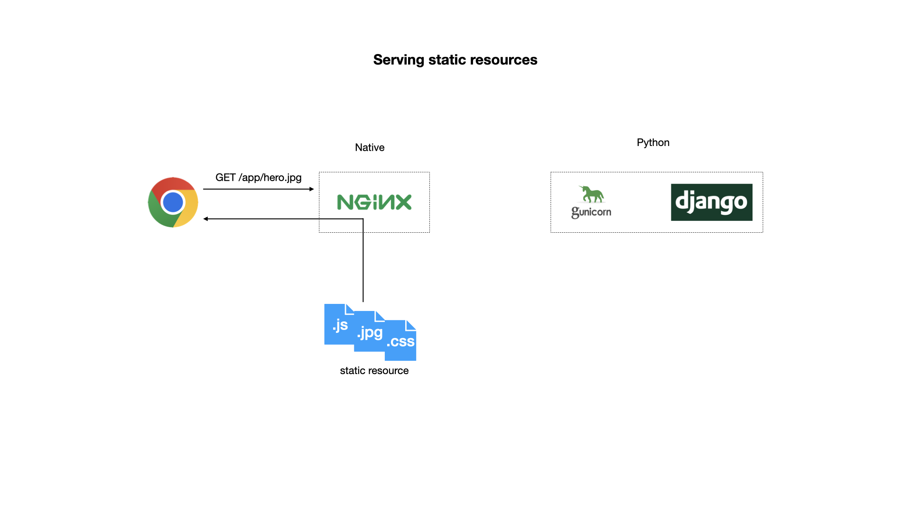
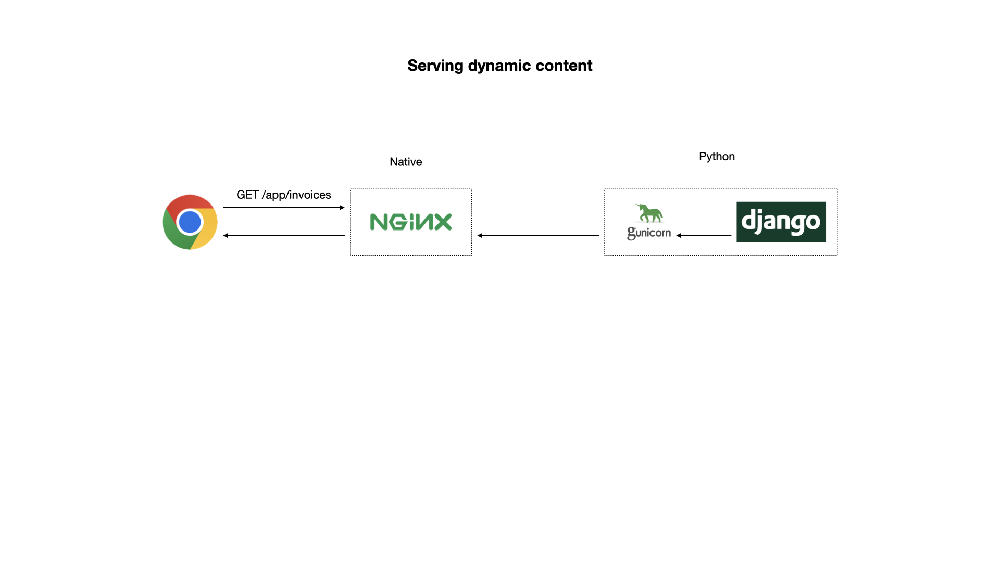
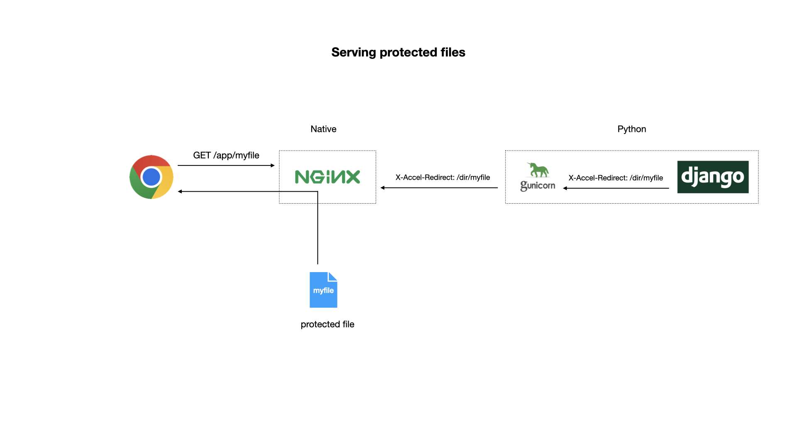

# Cloud Vault - A Demo Project for CSE 325 @ BUET

Cloud Vault is a web application that lets users store files in the cloud. It is a simple
application written in Django to demonstrate web application architecture to students of
CSE 325.

## Setting Up The Project

### Install Python 3

You need to make sure Python 3.10 or later is installed in your system. If you are using
Linux, use your distros package manager. If on Mac, use homebrew. If you are on Windows,
consider installing a better OS like Linux :)

### Set Up Project Repo

Clone the repo and create a python virtual environment to store our dependencies.

```shell
git clone git@github.com:unixdev/cloud-vault.git
cd cloud-vault
python3 -m venv ENV               # creates the virtual environment
source ./ENV/bin/activate         # activate the virtual environment
pip install --upgrade pip         # upgrade pip, it's a good thing to do
pip install -r requirements.txt   # install our dependencies in the virtual environment
```

### Set Up nginx

Install nginx with the package manager in your OS. The main configuration is
in [this file](docs/cloud_vault.conf). Put it in the `servers` or `sites-available`
folder in the nginx config folder. You will need to add a symlink in the
`sites-enabled` folder.  Also place the [proxy_params](docs/proxy_params)
file in the main folder of nginx configuration.

### Set Up redis

Just install redis using the package manager of your OS.

## Django Production Setup

Django is not optimized for file downloads. So we use a web server to
serve static resources like JavaScript files and image files in a production
environment. Usually, apache or nginx is used as the web server. They are highly
efficient in transferring static resources and large files.

In a production environment, we usually use apache or nginx as a front-end
web server. The receive all requests from the client, then passes the dynamic
content requests to django, while they handle the static resource requests
themselves. You can say that apache/nginx is used as a "reverse proxy" in this
case. This is illustrated in the following diagram:



Django can not handle requests from apache/nginx directly though. We need
another server, wsgi server to mediate between the two. A popular wsgi server
for Django is `gunicorn`. We can install it as a dependency in our django
project. The following diagram shows how django handles dynamic resources
through gunicorn and nginx:



### Serving Protected Files

The main feature of our application is letting users upload and download files.
Django makes uploading files very easy. If the file was public, i.e. it could be
downloaded by unauthenticated users - downloading would be simple. It works the
same way as serving static resources. But in our application, we want only authenticated
users to access their files.

Django and some popular servers have a special feature for this situation. The
request for serving a protected file would come to django first. We will check
our authentication in Django. Then, django will send an HTTP response with a
special header. When this response goes to nginx, on its way back to the users
browser, nginx will see the header. The header contains the location of the file
to serve to the user. nginx will load the file and serve its contents to the user,
instead of passing the response (with the special hader and empty body) from django.
The following diagram illustrates this setup:



## Message Queue

In our application, we send an SMS message to the user during verification. We send
the SMS by calling a remote API provided by an SMS gateway. While we call this
external API directly from the code that handles the HTTP request, it is usually not
a good idea in production. The best solution in this scenario is using a message
queue. We post a message in the queue. A queue listener receives the message
asynchronously, then does the remote API call.

While we can integrate a message queue directly with django, the code for it becomes
unwieldy. There is a package named `Celery` that makes this integration quite easy. Another
advantage of using celery is that we can change the message queue software (often called
a message broker) very easily. In this project, we used celery and then we used `redis`
as a message broker. It is quite easy to replace redis with a more traditional message
broker like `RabbitMQ` or `ActiveMQ`.
