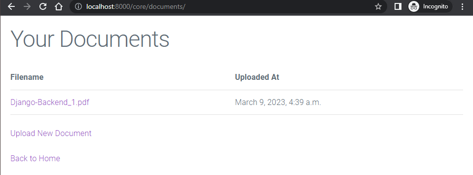

<h1 align="center">CSE 325 - Information System Design</h1>

<h3 align="center">Notes on Lecture-06</h3>
<h2 align="center">Building a Demo Website</h2>
<p align="center"><b>Submitted by</b></p>
<p align="center">Muhammad Ehsanul Kader - 1805067</p>
<p align="center">Showvik Biswas - 1805068</p>
<p align="center">Kazi Ababil Azam - 1805077</p>
<p align="center">Anup Bhowmik - 1805082</p>
<p align="center">Fardin Anam Aungon - 1805087</p>
<p align="center">Md. Nazmul Islam Ananto - 1805093</p>
<br>
<p align="center">Group - 4</p>
<p align="center">Section: B1</p>
<p align="center">Department of Computer Science and Engineering</p>
<p align="center">Bangladesh University of Engineering & Technology</p>

---

<h1 align="center">Table of Contents</h1>

- [Part 1: Planning](#planning)
- [Part 2: Language Selection](#language-selection)
- [Part 3: Framework Selection](#framework-selection)
- [Part 4: Django Setup](#django-setup)
- [Part 5: Django Backend](#django-backend)
- [Part 6: Cloud Vault](#cloud-vault)


---

<h1 align="center" id="planning"> Part 1: Planning </h1>

<h4 align="center"> Timestamp: 00:00 - 00:52 </h4>
<h4 align="center"> Muhammad Ehsanul Kader - 1805067 </h4>

---

## Plan before you start:

Think of a software like a building. Before you start, you have to lay the foundation for the building. You have to know beforehand how many floors the building will have and lay the foundation accordingly. If the foundation is shallow, high buildings will fall down. If the foundation is too deep, too much money will be spent on the foundation leaving not enough for the main building. Like this we need to establish some rules before starting making software:

1. **Communication:** Setting communication modality is necessary before starting a project. One can make the whole software and give it to clients. In this approach the client and the developers need to be aware of all the requirements before development starts, i.e. they need to be on the same page. This is the traditional approach. But, requirements may evolve and gaps may occur during meetings and discussions. Therefore, another approach is to make a part of the software as per requirements and then take reviews from clients on that version and then make changes accordingly, which will be done repeatedly. This approach is called *agile programming*. Currently hybrid approach is taken, where estimation is done in traditional approach but development is agile. 
2. **Set expectations:** We have to find out what the customer expects. The features of the application should be clearly settled.  We have to decide how the UI will turn out as well as the number of people the software can serve. The project timeline, budget, and potential risks should also be clearly discussed with the client.
3. **Set requirements in details:** Customers are vague in their expectations. Therefore, developers have to read between the lines to understand the requirements. Software development life cycle is an ideal case, but hard to follow in real life as small requirements come out during development which were not present in initial requirements.
4. **Set boundary:** Suppose, a client asks to design an accounting system. But according to the client, an accounting system is not just the records of the bills and accounts, it involves other components too. They may expect the salary control of the HR department to be included in the system, which begs the question of boundaries between the modules. Setting boundaries is important because the clients do not understand the modularity of the software, they deal with the software as a whole.
   Most software projects (reportedly 80%) fail completely or partially because they don't match with what the client expect. To avoid failure we have to set boundaries before we start working on a project.

## Choosing deployment platform:

When we start working on a project we have to think about where we are going to deploy our project 

* In premise: 
  This refers to deploying your project on servers that are physically located on your organization's premises.
* Cloud: 
  Cloud deployment refers to deploying your project on servers hosted by third-party cloud providers such as Amazon Web Services (AWS), Microsoft Azure, or Google Cloud Platform.
* Hybrid: 
  A hybrid deployment combines on-premise and cloud deployment models.

## Screenflow example:

For this demo, we are designing a simple application to upload and download files, we will call it "Cloud Vault". The screen flow is as follows :-


---

<h1 align="center" id="language-selection"> Part 2: Language Selection </h1>

<h4 align="center"> Timestamp: 00:52 - 01:00 </h4>
<h4 align="center"> Showvik Biswas - 1805067 </h4>

---

Choosing the right language for the project is quintissential for a successful development path. While building an application, we need to figure out the client's needs at first. A basic sketch of the application can be developed from there onward. It is then the duty of the system designer to pick a programming language which is tailored to cater the needs of the client, making the job of the frontend and backend designers easy. Today, there is a plethora of options to choose from. As we will focus mainly on web development, we will divide our options into two categories, **frontend** and **backend**.

## Frontend Languages

Frontend languages are used to actually render content on the browser. In most cases, the frontend requests the backend for data, and displays it in a suitable format on the page. There are a variety of languages available today for frontend design. Each one is not mecessarily a competitor to another; some are actually used in conjunction with each other. Depending on the needs of the user, as described later, we can pick the frontend language that is most suitable.

### HTML

Short for hyper-text markup language, HTML is the basic language that browsers understand when it comes to **rendering**, or displaying something on the screen. Currently, the standard is HTML5. Basic HTML is used for rendering static content. Writing a frontend application purely in HTML will make the page lightweight and fast, as HTML files are small in size and the browser can directly process them. Here is an HTML snippet writing a sentence on a page:

```html
<html>
<body>
<p>This is a sentence.</p>
</body>
</html>
```

### CSS

Cascading Style Sheets, or CSS is used in conjunction with HTML to format the frontend of a website. HTML itself can only produce the basic structure of the website, but cannot go far in actually *formatting* the website, i.e. accurately setting size, colors, position, transparency, etc. CSS works by identifying classes within HTML code and setting relevant properties to those classes. Here is a snippet of HTML with CSS coloring the previous sentence in HTML red:

```html
<html>
p {
    color: red;
}
<body>
<p>This is a sentence.</p>
</body>
</html>
```

### JavaScript

JavaScript is a programming language that will add high level functionality to the website. For example, we have created a button using HTML and CSS on our web page. Now, when we click the button, maybe, we want to write a message to the website's *console*.

With HTML, CSS and JavaScript, we can essentially build the frontend to most of the website that we need. Before progressing further, let us look at the trio just discussed. If we are trying to build websites that have extremely complex user interfaces, and are constantly being updated on user actions, this trio is not the best way to go. As we discussed, HTML can only render static content. If we want to add/update/remove content from the page, we have to take the help of JS. The codebase for complex applications will be complicated for a complex web page. We can look to other solutions then.

Here is a JavaScript snippet which fills a document with some text, even though the HTML code does not contain any:

```html
<html>
<body>
<p id="test"></p>
</body>
<script>
document.getElementById("test").innerHTML = "Added Text";
</script>
</html>
```

### Django Templates

If we are using **Django** as our backend framework, we can take help of the **Django Templating Engine**. Django templates are mostly HTML, but can make life easier with templates. For example, looping is unavailable in plain HTML. At best, we can use JS to add elements to a webpage in a loop. However, Django templates has its own for loop support and can render HTML elements in a loop without the user having to write JavaScript functions for them. This is just an example usage of Django templates, and it has support for many more items, such as generating CSRF tokens, forms, variable substitutions, if-else blocks, etc. Django templates can also be used to apply the concept of inheritance to web pages, reducing the amount of HTML code needed to be written. Here is such an example:

```django


Title


    <h1>This is some text.</h1>
    <p>This is some smaller text.</p>

```

### JSX

Perhaps the most popular language used today is JSX, which is a mixture of HTML and JavaScript. Instead of separating the HTML and JS, JSX supports writing JavaScript blocks inside HTML code, and this means that we do not have to write separate JavaScript methods to make our website dynamic. JSX is used in **React*, which is a very popular framework for rendering single page applications, or SPAs.

```jsx
class MyComponent extends React.Component {
  render() {
    return (
      <div>
        <h1>Some header</h1>
        <p>and some paragraph in JSX, which is written inside JavaScript</p>
      </div>
    );
  }
}

export default MyComponent;
```

## Backend Languages

The backend of a website refers to the part of the website that is responsible for server-side operations and processing. It includes the web server, application server, database server, and other backend technologies that power the website's functionality.

The backend handles tasks such as processing user input, retrieving and storing data, and managing user accounts and sessions. It communicates with the frontend of the website, which is responsible for displaying the content to the user. The available languages for backend design are:

### PHP

PHP is one o the earliest backend languages to be used in website design. It is fairly simple to learn and understand. One of the major advantages of PHP is that it is very flexible, and a lot of functionalities can be implemented in PHP with ease. Some very popular content management websites, such as WordPress, Joomla were actually built in PHP. Using PHP, one can also generate HTML, CSS and JS code, which can then be sent to the client directly, enabling server side rendering. 

However, it is not wise to use PHP from scratch to design a web application. Today, many frameworks have been built using PHP which will give the developer a head start in their work of designing the backend. The most popular frameworks in PHP are Laravel, CodeIgniter, Symfony, etc.

```php
<?php
$text = "web design";
echo "Nothing is as fun as " . $text . "!";
?>
```

### JavaScript

NodeJS is a runtime enviornment which can run JavaScript outside the browser. Given the versatility of JS, it is a good idea to use this runtime environment in a server machine to build the server logic. 

The biggest advantage of using JavaScript as a backend language is that JavaScript can be used in both the front and backends, reducing the tech stack complexity. The versatility of NodeJS has allowed many popular frameworks to be built upon it. ExpressJS can be used to assist in creating a website. Other libraries, such as Mongoose exist that can help the backend connect to a database. Writing code in JavaScript is easy, and the code length required is little, making it a perfect candidate to write backend code in. Additionally, NodeJS is built on the V8 JavaScript engine, which provides excellent performance and scalability. Here is a snippet of an ExpressJS code which sends plaintext response when a user hits the root directory of the website.

```javascript
const express = require('express');
const app = express();

app.get('/', function(req, res) {
  res.send('Plaintext response');
});

app.listen(3000, function() {
  console.log('Server on port 3000');
});
```

### C#

C# is used with the .NET framework. The .NET framework provides a set of APIs for handling common tasks, such as database access, session management, and authentication, which can help developers build web applications quickly and efficiently. The frameworks available for C# code on the backend are: ASP.NET, .NET Core, NancyFX, ServiceStack, etc. C# provides developers with a powerful set of tools for building backend web applications. Many popular websites, such as Microsoft's, has been built using the powerful frameworks of C#. C# is a good candidate for web design if we need to allow for web API development, MVC architecture support, and future scalability. A C# snippet showing a simple demo text message on the browser console:

```csharp
using System;

namespace Demo
{
    class Program
    {
        static void Main(string[] args)
        {
            Console.WriteLine("Demo Text");
        }
    }
}
```

### Java

Java as a language is mainly used for application development. However, its robust support for networking allows it to be used as a backend language. There is only one particular framework which is used today, and that is Spring Boot. We might want to use Java to build our backend because Java code is machine independent, and our backend code will virtually run on any server machine (Windows, Linux, or Mac) allowing very versatile portability. Using Java as the backend language will provide us vast support in

1. Building RESTful API
2. Building microservices
3. Building cloud-native applications

Here is an example Java code which returns some plain demo text when the user hits the root directory of a website.

```java
@RestController
public class DemoController {

    @GetMapping("/")
    public String demo() {
        return "Demo text";
    }

    public static void main(String[] args) {
        SpringApplication.run(DemoController.class, args);
    }

}
```

### Python

Python is arguably one of the most used programming languages today. Its stretch has reached the realms of backend development as well. Even though it is not as robust as Java, Python is extremely easy to learn, and implementing very complex logic is only a matter of a few code lines with Python. It has an unparalleled community support, and will cater to almost all needs of the web designer. Perhaps the biggest reason to use Python as a backend language is Django. Django is an extremely well built framework written in Python for backend logic. It has tools for almost everything, starting from user authentication to CSRF protection. Python can also integrate with other technologies, such as databases, front-end frameworks, and other languages. This makes it easy to connect with other components and build robust and dynamic web applications. Here is an example similar to the Java example:

```python
from django.http import HttpResponse

def try(request):
    return HttpResponse("trial")
```

### Ruby on Rails

Ruby is also an excellent choice in building the backend, particularly for its framework Ruby on Rails. Ruby can prove to be particularly useful when the developer has scalability and community support in mind. Ruby on Rails includes a wide range of pre-built tools and libraries that simplify common web development tasks, such as routing, database migrations, and authentication. 

This code defines a controller class called UsersController in a Ruby on Rails application. The controller defines a single action called index that retrieves all user records from the database using the User.all method and assigns them to an instance variable called @users, when the user requests the *index* acton.

```ruby
class UsersController < ApplicationController
  def index
    @users = User.all
  end
end
```

---

<h1 align="center" id="framework-selection"> Part 3: Framework Selection </h1>

<h4 align="center"> Timestamp: 01:00 - 01:20 </h4>
<h4 align="center"> Kazi Ababil Azam - 1805077 </h4>

---

The next step is choosing a framework to work on. A software framework is an abstraction in which software, providing generic functionality, can be selectively changed by additional user-written code. Software development frameworks offer structures and environment setups to streamline the development process. It also provides a set of guidelines that need to be followed while building an application. The primary purpose of using a software development framework is to save time and effort.

## Importance of choosing the right framework

It is important to choose an effective software development framework that meets your project requirements. It must be easy to learn and use, provide better control over the application, offer a wide range of features, cost-effective, and perfectly aligns with your business goals. Choosing an efficient and relevant software development framework also gives you an edge over the competition. Selecting the wrong framework can result in poor performance of the application, longer development time, and increased costs.

## Types of frameworks

A **frontend framework** is a collection of tools and libraries that are used to build the user interface (UI) of a web application. It is used to create the visual elements of the application. Examples include React and Angular, both very popular frameworks.

A **backend framework** is a collection of tools and libraries that are used to build the server-side of a web application. It is used to create the logic and functionality of the application. Examples are Node.js, Ruby on Rails and Django.

A **full-stack framework** is a combination of both frontend and backend frameworks. Examples include MERN (MongoDB, Express, React, and Node.js) and MEAN (MongoDB, Express, Angular, and Node.js) stack.Using JavaScript for front-end and back-end development, these stacks allow efficient development of web applications.

## Web applications and rendering

Server-side rendering and client-side rendering are two approaches to rendering web pages in a web application. 

In **server-side rendering**, the web server renders the HTML for each page on the server and sends the pre-rendered HTML to the client's browser. This approach is typically used with traditional web applications and involves generating HTML pages for each request. In **client-side rendering**, the web browser downloads the necessary JavaScript files and renders the HTML for each page on the client's computer. 

There are some pros and cons to each approach, and many modern web applications use a **hybrid approach** that combines both server-side and client-side rendering. This hybrid approach can provide the best of both worlds, allowing for fast initial page loads, good SEO, and dynamic client-side interactions.

### React

React is a popular and powerful JavaScript library for building user interfaces (UIs). React is also widely used and has a large and active community. It is also used by some of the biggest companies in the world, such as Facebook, Instagram, Netflix, etc.

Some of the key advantages of using React include its component-based architecture, which makes it easy to build and maintain large, complex UIs, and its virtual DOM allowing for efficient updates. Although, it has a steep learning curve, particularly for developers who are new to component-based architectures. 

Overall, React is a versatile and powerful tool for building modern web applications and UIs, mostly server-side rendering applications with Next.js and mobile apps using tools like React Native.

### Angular

Angular is an open-source framework for building web applications, developed and maintained by Google. It uses a component-based architecture and is built on TypeScript, a superset of JavaScript that includes optional static typing.

Pros using Angular include its component-based architecture and its use of TypeScript, which can help catch errors early and improve code maintainability. 

Use cases for Angular include building large and complex web applications, particularly those that require robust data binding and real-time updates. Angular is also well-suited for building enterprise-level applications, as it includes many features that are important for large-scale development, such as dependency injection, testing support, and internationalization.

### Next.js

Next.js is an open-source React framework for building server-side rendered web applications.

One of the key advantages of using Next.js is that it allows developers to build fully-featured web applications that can be rendered on both the server and the client, which can can help improve page load times and overall user experience. Disadvantages of using Next.js include its reliance on React, which can be a limiting factor for some developers who prefer other frameworks or libraries.

Use cases for Next.js include building modern web applications that require server-side rendering or static site generation, such as e-commerce sites. Next.js is also well-suited for building microservices and APIs that can be easily integrated with other systems.

### Laravel

Laravel is a free and open-source web application framework built on top of PHP that provides a set of tools and features for building web applications quickly and efficiently. It follows the Model-View-Controller (MVC) architectural pattern. 

Laravel provides a powerful and flexible framework for building web applications.
It is easy to use, great for building RESTful APIs, and strong community support.

Use cases include e-commerce sites, social networks, and content management systems.

### Express.js

Express.js is a popular open-source framework for building server-side web applications with Node.js. It is known for its simplicity, flexibility, and ease of use.

Some of the key advantages of using Express.js include its lightweight and minimalist architecture, which allows for greater flexibility and control over the application's behavior. Since Express.js is a low-level framework, it can require more manual configuration and setup than other tools.

Use cases for Express.js include building APIs, microservices, and web applications that require lightweight and fast backends. Express.js is also well-suited for building scalable and maintainable applications.

### Nest.js

Nest.js is a popular open-source framework for building server-side web applications with Node.js. It  is built on top of the widely-used Express.js framework and provides a set of additional features and tools for building scalable and maintainable web applications.

Overall, Nest.js is a powerful and flexible framework for building server-side web applications with Node.js. While it does have some drawbacks, its many advantages and extensive features make it a solid choice for developers looking to build complex and scalable applications with a modular architecture. Use cases for Nest.js include building scalable and maintainable web applications, particularly those that require complex data handling or integration with external systems. Nest.js is also well-suited for building microservices and APIs that can be easily integrated with other systems.

### Django

Django is a free and open-source web application framework built on top of Python that provides a set of tools and features for building web applications quickly and efficiently. It follows the Model-View-Controller (MVC) architectural pattern.

Django boasts strong security features, built-in administrative interface. It works great for rapid development, and can be scaled to support large applications if needed. Though it has a steep learning curve for beginners.

Django is ideally used for building content-heavy sites, such as news sites, social networks, and e-commerce sites.

---

<h1 align="center" id="django-setup"> Part 4: Django Setup </h1>

<h4 align="center"> Timestamp: 01:20 - 01:53 </h4>
<h4 align="center"> Anup Bhowmik - 1805082 </h4>

---

Before we go ahead and setup Django in our machine, let't take a brief moment to learn some basics.

## Django as a framework

Django is a free and open-source, Python-based web framework that follows the model–template–views architectural pattern. It is maintained by the Django Software Foundation.
The key features of Django that makes it a good choice for development are as follows

- Excellent Documentation
- `Python` Web-framework
- SEO Optimized
- High Scalability
- Offers High Security
- Provides Rapid Development

The last point is very important in this lecture's context because the instructor has chosen this framework for this very reason. The implications of this are: we do not need to manage separate server files in order to build a fully functional website. It also supports server side rendering which makes the website blazing fast. 

Django allows us to add, delete, modify and query objects, using an API called `ORM` (Object Relational Mapping). This significantly boosts the development speed as we don't need to worry about the SQL queries and interact with the database `models`.

If the above discussion makes you believe that Django is an impressive framework (which in fact, it is), let's fire up our machine (Linux, Windows or Mac) and install it. But before we begin, we need to remember the followings

## Things to remember

- Packages <br>
    Two of the most commonly used package managers are
  
  - pip
    
    ```bash
    python get-pip.py
    ```
  
  - The Python Package Index (PyPI)
    
    ```bash
    pip install pypi-install
    ```

- Virtual Environment <br>
  Usually we don't install packages to our host machine. We prefer installing them in a virtual environment. This is useful because there might be cases where we need different versions of the same package in different apps. However, it is not possible to have more than one version installed in the host machine. But thanks to virtual environment, it is possible.  

- Multiple `App` support under same project <br>
  We can reuse some apps in different projects or publish them as packages

- Model <br>
  The use of `ORM`

- Form <br>
  At the heart of the system of components is Django’s `Form` class. In much the same way that a Django model describes the logical structure of an object, its behavior, and the way its parts are represented to us, a Form class describes a form and determines how it works and appears.
  
    A `ModelForm` maps a model class’s fields to HTML form `<input>` elements via a Form. This is what the `Django admin` is based upon.

- View Function <br>
  Django views are Python functions that takes HTTP requests and returns HTTP response, like HTML documents. A web page that uses Django is full of views with different tasks and missions. Views are usually put in a file called `views.py`.

This is about time we get down to coding.

## Setup process

1. Install `python` <br>
   check the version using
   
   ```bash
   python --version
   ```

2. Install `pip` <br>
   If `pip --version` is not found, you need to install it
   
   ```bash
   python get-pip.py
   ```

3. Let's install `Django`. But hold on for a second. We don't want to install it on our system OS because we might want to use a different configuration for different projects. Let's create a `virtual environment`.
   
   - install python virtual environment
     
     ```bash
       pip install virtualenv
     ```
   
   - create a virtual environment
     
     ```bash
       virtualenv ENV
     ```
   
   - activate the virtual environment
     
     ```bash
       ENV\Scripts\activate
     ```
   
   - now install Django
     
     ```bash
       pip install django
     ```
     
     Check the version
     
     ```bash
       django-admin --version
     ```
   
   - Create a new Django project
     
     ```bash
       django-admin startproject {project name}
     ```
     
     - You can choose to create an app at this point to better modularize your project
     
     ```bash
        python manage.py startapp {app name}
     ```
     
     - cd to your project directory and run the server
     
     ```bash
        python manage.py runserver
     ```
     
     You'll see on your terminal
     
     ```bash
        Starting development server at http://127.0.0.1:8000/
     ```
     
     Now if you go to that url, you can see your project is up and running.

## Dependency resolve

After making some changes and adding installing some packages, you might want to enlist them in some format. The best way is to write it on requirements.txt file 

```bash
    pip freeze > requirements.txt
```

If you are working on a currently working project, you might need to install dependencies

```bash
    pip install --upgrade pip
    pip install -r requirements.txt
```

This will install all the packages written in requirements.txt

---

<h1 align="center" id="django-backend"> Part 5: Django Backend </h1>

<h4 align="center"> Timestamp: 01:53 - 02:15 </h4>
<h4 align="center"> Fardin Anam Aungon - 1805087 </h4>

---

Django is a high-level Python web framework that provides a powerful toolkit for building web applications quickly and efficiently. It follows the model-view-controller (MVC) architectural pattern and emphasizes the "don't repeat yourself" (DRY) principle. In this note, we will cover some of the core concepts of Django including Django apps, models, form classes, views classes and urls.

## Django Apps

A Django app is a self-contained module that provides specific functionality to your web application. It can include models, views, templates, and other components necessary to achieve a particular feature. For example, you may have an app for user authentication, an app for blog posts, and an app for e-commerce products. Django apps are reusable and can be shared across different projects or can be published as package. To create a new app, you can use the startapp command:

```bash
  $ python manage.py startapp myapp
```

This will create a new directory called `myapp` in your project directory, which will contain the necessary files and folders for a Django app.

## Models

A model is a Python class that represents a database table. It defines the fields and behaviors of the data you want to store. Each model corresponds to a table in the database, and each attribute of the model corresponds to a column in the table. Django provides a built-in Object-Relational Mapping (ORM) that allows you to interact with the database using Python code instead of SQL queries. Here's an example of a simple model for a blog post:

```python
  from django.db import models

  class Post(models.Model):
    title = models.CharField(max_length=200)
    content = models.TextField()
    pub_date = models.DateTimeField(auto_now_add=True)
```

The `Post` model has three fields: `title`, `content`, and `pub_date`. Each field is represented by an instance of a Field class - e.g., `CharField` for character fields and `DateTimeField` for date and time. The name of each Field instance (e.g., `title`, `content`, and `pub_date`) is the field's name, in machine-friendly format. You'll use this value in your Python code, and your database will use it as the column name.

## Form Classes

A form class is a Python class that defines the fields and validation rules for a web form. Django provides a built-in Form class that you can subclass to create your own forms. Here's an example of a simple form for creating a new blog post:

```python
  from django import forms

  class PostForm(forms.Form):
    title = forms.CharField(max_length=200)
    content = forms.CharField(widget=forms.Textarea)
```

This form defines two fields: `title` and `content`. The `CharField` is used for single-line text input, while the `Textarea` widget is used for multi-line text input. You can also specify validation rules for each field, such as maximum length, required fields, and data types.

Another way of creating a form is to use a ModelForm class. A `ModelForm` class is a form class that is automatically generated from a model class. Here's an example of a ModelForm class for the `Post` model:

```python
  from django import forms
  from .models import Post

  class PostForm(forms.ModelForm):
    class Meta:
      model = Post
      fields = ['title', 'content']
```

This form class will automatically generate a form with the same fields as the `Post` model. You can also specify additional fields that are not present in the model.

## Views Classes

A view class is a Python class that handles HTTP requests and returns HTTP responses. It connects the user interface with the business logic of your application. Django provides several built-in view classes that you can subclass to create your own views. Here's an example of a simple view for displaying a list of blog posts:

```python
  from django.views import View
  from django.shortcuts import render
  from .models import Post

  class PostListView(View):
    def get(self, request):
      posts = Post.objects.all()
      return render(request, 'post_list.html', {'posts': posts})
```

This view defines a `PostListView` class that inherits from the `View` class. It implements the `get()` method, which is called when a GET request is received. It retrieves all the blog posts from the database using the `objects.all()` method, and then renders the `post_list.html` template with the list of posts.

## Templates

Django templates are a key component of the Django web framework. They allow you to separate the presentation logic from the application logic, making it easier to create dynamic web pages that display data from the backend.

A Django template is a text file that contains a mix of HTML, CSS, and Django template language (DTL) code. The DTL code allows you to embed Python code into your HTML templates, making it possible to dynamically generate content and perform other operations.

Here's an example of a simple Django template that displays a list of blog posts:

```django
  
  
    <h1>Blog Posts</h1>
    <ul>
    
      <li><a href="">{{ post.title }}</a></li>
    
      <li>No posts yet.</li>
    
    </ul>
  
```

This template extends a base template called `base.html` and defines a `content` block where the main content of the page will be displayed. It uses the `for` loop to iterate over a list of `posts` and generate a list item for each `post`. The `url` template tag generates a URL for the `post_detail` view, which will display the details of the selected post.

You can also use template inheritance to create reusable templates that can be used across multiple pages of your site. Here's an example of a simple base template that defines a common header and footer for all pages:

```django
  <!DOCTYPE html>
  <html>
  <head>
    <title></title>
  </head>
  <body>
    <header>
      <h1>My Site</h1>
      <nav>
        <ul>
          <li><a href="">Home</a></li>
          <li><a href="">Blog</a></li>
          <li><a href="">About</a></li>
        </ul>
      </nav>
    </header>
    <main>
      
      
    </main>
    <footer>
      <p>© My Site 2023</p>
    </footer>
  </body>
</html>
```

`Note`: The `url` template tag generates a URL for the `home`, `blog`, and `about` views, which will display the home page, blog page, and about page, respectively. It refers to the url patterns defined in the `urls.py` file. (discussed [here](#urls))

This base template defines a `title` block that can be overridden by child templates to set the title of the page. It also defines a `content` block that child templates can use to insert their own content. By using template inheritance, you can create a consistent look and feel across all the pages of your site while minimizing code duplication.

### What is the importance of `csrf_token`?

In Django, the CSRF (Cross-Site Request Forgery) token is a security measure that is used to protect against malicious attacks such as cross-site scripting (XSS) and cross-site request forgery (CSRF).

When a user submits a form on a website, Django generates a unique token that is added to the form as a hidden field. This token is also stored in the user's session cookie. When the user submits the form, the token is included in the request data. The server then checks whether the token in the request data matches the one stored in the session cookie. If the tokens match, the server knows that the request came from a legitimate user and can process the request. If the tokens don't match, the server can reject the request.

The CSRF token is important because it helps prevent attackers from executing unauthorized actions on behalf of a user. Without the CSRF token, an attacker could trick a user into clicking a link or submitting a form that performs an action on the user's behalf (such as deleting a record or changing a password) without the user's knowledge or consent.

In Django, you can include the CSRF token in your HTML forms using the `` template tag. Django also provides middleware that automatically adds the CSRF token to every form in your application. To enable CSRF protection, you need to add the `csrf` middleware to your MIDDLEWARE setting in your project's `settings.py` file.

## URLs

In Django, URLs define how requests are mapped to views, which are responsible for handling the request and returning an HTTP response. URLs are defined in a separate module called `urls.py`, which is typically located in the same directory as the Django app or project.

Here's an example of a simple `urls.py` file that maps URLs to views:

```python
  from django.urls import path
  from . import views

  urlpatterns = [
    path('', views.index, name='index'),
    path('about/', views.about, name='about'),
    path('blog/', views.blog, name='blog'),
    path('blog/<int:pk>/', views.post_detail, name='post_detail'),
  ]
```

This `urls.py` file defines four URL patterns using the `path()` function. The first pattern maps the root URL (`/`) to the `index` view, the second pattern maps the `/about/` URL to the `about` view, and the third pattern maps the `/blog/` URL to the blog view. The fourth pattern is more complex and includes a URL parameter (`<int:pk>/`) that captures an integer value and passes it to the post_detail view.

Each URL pattern is associated with a view function that will handle requests that match the pattern. The `name` argument is used to give each URL pattern a unique name that can be used to generate URLs in your templates and views.

---

<h1 align="center" id="cloud-vault"> Part 6: Cloud Vault </h1>

<h4 align="center"> Timestamp: 02:15 - 02:36 </h4>
<h4 align="center"> Md. Nazmul Islam Ananto - 1805093 </h4>

---

We'll be creating a simple file storage system with **Django** with following features -

* **Metadata** or note could be added with files

* Files are **user specific** i.e. no user can see the files of another user

* Sign up and log in with **phone number** rather than email

* Phone number **verification** on sign up via OTP

## Screen Flow


## Why Django?

Django has excellent database support out of the box and are very easy to work with forms and models. As most of our features have form like functionalities (Sign up, Log in, File upload etc.), we though why not the mighty Django itself?

## Database of Choice

Django, by default, uses sqlite3 as it is super lightweight single file based database and easy to host with source code. In most simple cases, like ours, sqlite3 should be the database of choice. Other SQL or NoSQL databases are more likely to be an overkill in this case.

In most cases, the programmer don't have access to the **Production Database** and have to work with a **Testing Database** which may or may not be populated with some representative data from the production one. So it doesn't matter what database we are choosing in this point, it does not have to match the production one. Moreover, **Django ORM** takes care of most, if not all, of our needs so the underlying database choice matters little.

## Env Files in Django

Django has a package called `django-environ` which makes our life a bit easier by handling environmental variables in a `.env` file. We usually do not add this hidden file to the source code for both security and usability purpose.

- `.env` file usually contains our credentials such as our deployment server connection, database connection and any other connection or api key and we do not want to people other than us to see them for obvious reasons.

- Most of the times we use different **Development**, **Testing** and **Production** environment. So we want to tweak our environmental variables according to the current environment we are in. That's why we use different `.env` file at different environments and don't add that file to our version control.

## Custom User Model

The reason we'll be using a custom user model rather than the one provided by Django is that the built in onw requires username where we are interested in phone no. based user authentication. So we make these changes in `models.py`-

```python
from django.db import models
from django.core.validators import RegexValidator
from django.contrib.auth.models import AbstractBaseUser
from django.utils.translation import gettext_lazy as _

class User(AbstractBaseUser):
    """
    Custom user model.
    """
    phone = models.CharField(
        _('phone number'),
        validators=[RegexValidator(regex=r'^0[0-9]{10}$')],
        max_length=11,
        help_text='e.g. 01712345678',
        unique=True
    )
    email = models.EmailField(blank=True)
    is_active = models.BooleanField(_('active'), default=True)
    created_at = models.DateTimeField(auto_now_add=True)

    objects = UserManager()

    USERNAME_FIELD = 'phone'
    EMAIL_FIELD = 'email'
    REQUIRED_FIELDS = []
```

As we are planning to use the `phone` numbers as our primary key so it needs be unique here. Also, `email` is not mandatory in our application of course. Another thing to notice that we are using a field `is_active` to track if the user created is activated or not. They will be activated once they are verified. Last but not the least, `created_at` and `modified_at` are two fields we should have in almost every models. They help us debug our system by such means we cannot even imagine. In this particular case, `modified_at` is not necessary as we are not allowing change in users after creation.

One thing to remember is that Django has it's own ORM out of the box. So when we make some change in `models.py`, we just need to execute `./manage.py migrate`.

An ORM gives us the flexibility of working only with objects and JSONs rather than writing repeatative, long and boring SQLs.

Here we are using **regex** to validate phone number and **gettext_lazy** method to add a string name to the model field. The fun part is this concize piece of code is capable of creating the whole form, with the help of `forms.py`, run the validators and show appropriate messages upon those validations. It will also pack the whole model in a single dictionary for us to send to the database. How easy our lives are with Django, right?

One last nail in the coffin, to change `settings.py` and adding `AUTH_USER_MODEL = 'code.User'`

## Sign Up Form

To create the form with our specific fields, we need make these changes in the `forms.py` file -

```python
class SignupForm(UserCreationForm):
    """
    Create a user with phone and password.
    """
    class Meta:
        model = User
        fields = ('phone', 'email')

    def save(self, commit=True):
        if commit:
            code = gen_verify_code()
            with transaction.atomic():
                user = super().save(True)
                verification = Verification(user=user, code=code)
                verification.save()
            logger.info('set verification for %s with code: %s', user.phone, code)

            # send the verification code through SMS
            start = time.time()
            send_task.delay(user.phone, f'Cloud Vault Verification Code: {code}')
            end = time.time()

            logger.info('sent SMS in %dms', (end - start) * 1000)

            return user

        return super().save(False)
```

## Sign Up View

Let's make some changes in the `views.py` to get our custom form to show -

```python
class SignupView(CreateView):
    form_class = SignupForm
    template_name = 'core/signup.html'
    success_url = reverse_lazy('core:verify')

    def form_valid(self, form):
        user = form.save(commit=False)
        logger.info('submitted signup form with phone: %s', user.phone)
        user.is_active = False
        return super().form_valid(form)

    def get_success_url(self):
        return reverse('core:verify', args=[self.object.phone])
```

When our Sign Up URL gets a **GET** request, it is going to render the template and when it gets a **POST** request it will validate the form and then save it to the database.

The reason we differentiate these two is because most of the time we have the same URL for our GET and POST requests. When we hit reload after submitting the form once, it tries to send the POST request again so the browser often warns us of this. That is why we should redirect our user to some other page after submitting the form. Here we'll redirect them to the Sign Up Successful screen.

```python
def signup_success(request):
    context = {
        'login_url': reverse('core:login')
    }

    return render(request, 'core/signup_success.html', context)
```

In our `signup.html`, we should add some not so html lines to show our form. Django itself handles these lines and render plain html, css to the client.

```html


    <h1>Signup to Cloud Vault</h1>

    <form method="post">
        

        {{ form.as_div }}

        <input type="submit" value="Submit">
    </form>

```

Here `csrf` means Cross Site Request Forgery and this token is used to resist any other tab open in our browser to submit the form other than us. To understand more about csrf tokens, go to [this](https://stackoverflow.com/questions/5207160/what-is-a-csrf-token-what-is-its-importance-and-how-does-it-work) link.

The `form.as_div` line here basically shows us the form we created. As simple as that.

## How does it look?

Let's get a demo of what we did so far.

> python manage.py runserver


Upon running the server, we get served with this landing page. From here, let's signup first.


After we submitted our form, we were taken to the verification page. Here we have to add the verification number we got via SMS.

Now this is our signup successful page -


Now we can log in using our previously entered phone no. and password.


After we are logged in, we can see our home page.


Let's take a look at our Documents List page.


What about uploading a new document?


So we have chosen a document to upload and added some metadata or note against it. One thing to notice is in our system we did not specify any file type but we specified a mazimum file size of 2MB in `models.py` -

```python
def validate_file_size(file):
    limit = 2 * 1024 * 1024
    if file.size > limit:
        raise ValidationError(_('Maximum allowed file size is 2MB'))
```

And now we are being shown the documents we have uploaded so far.



That's almost it.

## Tools

[Celery](https://pypi.org/project/celery/) was used for implementing Task Queue.

We have used **[Redis]([Redis Message Broker | Redis Enterprise](https://redis.com/solutions/use-cases/messaging/))** for sending OTP through SMS as in our Message Queue.

For our basic CSS purpose, we used [**Milligram**](https://milligram.io/).

## References

- [CSE 325 Lecture-6](https://youtu.be/wEO_esQX3CI)

- [Cloud Vault](https://github.com/unixdev/cloud-vault)

- [Django documentation](https://docs.djangoproject.com/en/3.2/)
